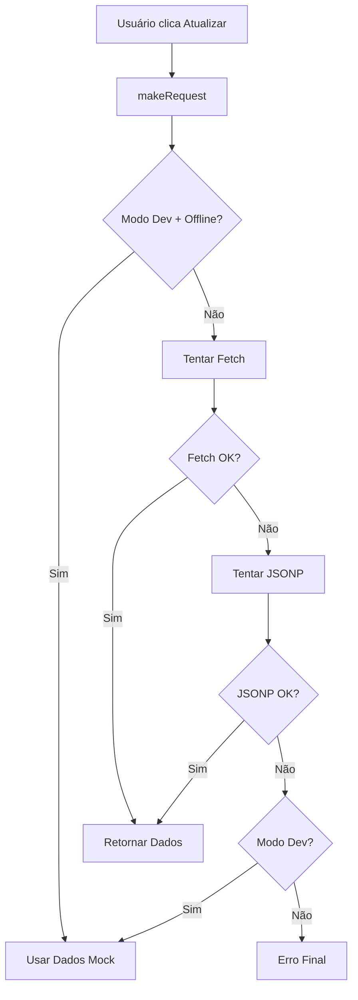

# Sistema de Gestão de Campeonato - Correção CORS

Este sistema foi desenvolvido para resolver problemas de CORS ao comunicar-se com Google Apps Script, implementando soluções robustas de fallback e tratamento de erros.

## 🚀 Características

- ✅ **Resolução de CORS**: Implementa JSONP como fallback para requisições cross-origin
- ✅ **Modo de Desenvolvimento**: Dados mock para testes offline
- ✅ **Detecção Automática de Ambiente**: Alterna automaticamente entre desenvolvimento e produção
- ✅ **Tratamento Robusto de Erros**: Múltiplas estratégias de fallback
- ✅ **Interface Responsiva**: Funciona em desktop e mobile
- ✅ **Logs de Debug**: Sistema completo de logging para diagnóstico
- ✅ **Conectividade Offline**: Funciona mesmo sem conexão com o servidor

## 📁 Estrutura de Arquivos

```
/
├── index.html              # Interface principal do sistema
├── config.js              # Configurações e constantes
├── app.js                 # Lógica principal da aplicação
├── styles.css             # Estilos CSS responsivos
├── google-apps-script.js  # Código para o Google Apps Script
├── README.md              # Esta documentação
└── docs/
    ├── setup-guide.md     # Guia de configuração detalhado
    └── troubleshooting.md # Guia de solução de problemas
```

## 🛠️ Configuração Rápida

### 1. Google Apps Script

1. Acesse [Google Apps Script](https://script.google.com/)
2. Crie um novo projeto
3. Cole o código do arquivo `google-apps-script.js`
4. Salve o projeto
5. Clique em **Implantar** > **Nova implantação**
6. Selecione **Aplicativo da web** como tipo
7. Configure:
   - **Executar como**: Sua conta
   - **Quem tem acesso**: Qualquer pessoa
8. Clique em **Implantar**
9. Copie a URL gerada

### 2. Configuração Local

1. Abra o arquivo `config.js`
2. Atualize a URL do Google Apps Script:
```javascript
GOOGLE_APPS_SCRIPT: {
    URL: 'SUA_URL_AQUI',
    // ...
}
```

### 3. Executar o Sistema

- **Desenvolvimento**: Abra `index.html` diretamente no navegador
- **Produção**: Hospede os arquivos em um servidor web

## 🔧 Como Funciona a Correção de CORS

### Problema Original
- **Erro 405**: Método não permitido
- **CORS bloqueado**: Política Same-Origin
- **NetworkError**: Falha na requisição fetch

### Solução Implementada

1. **Tentativa primária - Fetch com CORS**:
```javascript
const response = await fetch(url, {
    method: 'GET',
    mode: 'cors',
    headers: { 'Accept': 'application/json' }
});
```

2. **Fallback - JSONP**:
```javascript
// Se fetch falhar, usa JSONP
const script = document.createElement('script');
script.src = `${url}?callback=${callbackName}&${params}`;
```

3. **Último recurso - Dados Mock**:
```javascript
// Em desenvolvimento, usa dados locais
if (isDevelopment() && !isOnline) {
    return getMockData(action, params);
}
```

## 📊 Funcionalidades

### Interface Principal
- **Tabela de Classificação**: Mostra times ordenados por pontos
- **Formulário de Entrada**: Adiciona novos times/resultados
- **Status de Conexão**: Indica se está online/offline
- **Controles de Modo**: Alterna entre desenvolvimento/produção

### Recursos Técnicos
- **Timeout Configurável**: Evita travamentos em requisições
- **Retry Logic**: Tenta múltiplas vezes em caso de falha
- **Auto-detecção de Ambiente**: Detecta automaticamente localhost
- **Logs Visuais**: Interface de debug em tempo real

## 🐛 Solução de Problemas

### Erro CORS Persiste
1. Verifique se o Google Apps Script está configurado para "Qualquer pessoa"
2. Confirme que a URL está correta no `config.js`
3. Teste em modo de desenvolvimento primeiro

### Dados Não Carregam
1. Abra as ferramentas de desenvolvedor (F12)
2. Verifique os logs no console
3. Verifique os logs visuais na interface
4. Teste a conectividade com o botão "Testar Conexão"

### Modo Desenvolvimento
- Dados mock são carregados automaticamente
- Não requer conexão com Google Apps Script
- Ideal para desenvolvimento offline

## 🔄 Fluxo de Requisições



## 📝 Configurações Avançadas

### Timeouts e Retry
```javascript
REQUEST: {
    TIMEOUT: 10000,        // 10 segundos
    RETRY_ATTEMPTS: 3,     // 3 tentativas
    RETRY_DELAY: 1000,     // 1 segundo entre tentativas
}
```

### Debug e Logs
```javascript
DEBUG: {
    ENABLED: true,         // Ativar logs
    LOG_REQUESTS: true,    // Log de requisições
    LOG_RESPONSES: true,   // Log de respostas
    VERBOSE: true          // Logs detalhados
}
```

## 🚀 Deploy em Produção

### Hospedagem Estática
- GitHub Pages
- Netlify
- Vercel
- Surge.sh

### Configurações para Produção
1. No `config.js`, o modo produção é detectado automaticamente
2. Debug é desabilitado automaticamente
3. CORS é tratado transparentemente

## 📞 Suporte

Para problemas ou dúvidas:
1. Verifique os logs de debug na interface
2. Consulte o console do navegador (F12)
3. Teste primeiro em modo desenvolvimento
4. Verifique a configuração do Google Apps Script

## 🔒 Segurança

- URLs do Google Apps Script são públicas por design
- Dados são validados no client e server
- Não há exposição de credenciais sensíveis
- CORS é tratado de forma segura

## 📈 Monitoramento

O sistema inclui:
- **Status de conectividade** em tempo real
- **Logs visuais** de todas as operações
- **Indicadores de modo** (dev/prod)
- **Mensagens de erro** amigáveis ao usuário